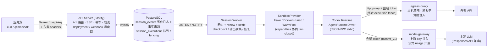

<div align="center">

# muse-replicate

**自托管的企业级 Managed Agents 平台** —— 版本化 Agent、事件溯源会话引擎、
沙箱隔离执行、凭据安全出站、Memory / Skills / 定时调度 / Webhooks，一套 API 全搞定。

[](https://nodejs.org)
[](https://www.typescriptlang.org)
[](docs/openapi.yaml)
[](#测试与验证)
[](#测试与验证)
[](LICENSE)

[快速开始](#快速开始) · [SDK 示例](#typescript-sdk) · [API 概览](#api-概览) · [架构](#架构) · [设计文档](docs/DESIGN.md)

</div>

---

## 这是什么

muse-replicate 是一个**私有化部署**的 Managed Agents 平台参考实现（对标 BigModel Managed Agents /
OpenAI Agents 托管形态）：业务方通过 HTTP API 定义 Agent、发起会话，平台在**隔离沙箱**中执行长时任务，
实时推送事件流（SSE），并把会话状态、产出文件、token 用量全部落账可查。

它不是玩具——以下问题都被认真设计并经过测试与混沌验证：

- **可靠性**：事件日志是唯一事实来源；execution 级 fencing 防双写；worker 崩溃后按 checkpoint /
  水位线自动恢复（Level 1 原生 resume / Level 0 语义重放）；毒任务自动回收。
- **安全性**：凭据 AES-256-GCM 双层信封加密、API 永不回显；沙箱出站走 egress-proxy（token 绑定
  fence + 主机策略 + 凭据注入）；模型调用经 model-gateway 注入上游 key，会话侧只见短期 token。
- **可替换性**：沙箱（`SandboxProvider`）、运行时（`AgentRuntimeDriver`）、快照存储
  （`SnapshotStore`）全部接口化——默认 Fake 实现支撑全套集成测试，接真实基础设施换实现即可。

## 核心能力

| 领域 | 能力 |
| --- | --- |
| **Agent 管理** | 版本化 CRUD（乐观锁、无变化不升版、metadata 按键合并）、归档联动、内置/自定义工具集与 MCP server 配置 |
| **会话引擎** | 三种 agent 引用形态（id / id+version / overrides）+ 快照固化；排队事件与处理时定序（seq 单调）；审批流（`requires_action` → `user.tool_confirmation`）；**自定义工具**（`agent.custom_tool_use` → 业务方回 `user.custom_tool_result`，api 即时定序续轮）；持久化中断（interrupt 是状态不是信号） |
| **可靠性** | `FOR UPDATE SKIP LOCKED` 抢占 + 30s 租约 + generation fencing；轮末不可变 checkpoint（sha256 校验 + fence CAS 发布）；水位线恢复与接管语义；`Idempotency-Key` 全量 POST 支持 |
| **实时** | SSE 事件流（LISTEN/NOTIFY、15s 心跳、Last-Event-ID 回补、会话删除自动关闭） |
| **安全** | Vault / Credentials（信封加密、轮换、脱敏回显）；egress-proxy（出站 token 绑定执行 fence、平台黑名单、limited/unrestricted 网络策略、竞争头剥离与凭据注入、拒绝可观察）；model-gateway（会话 token 鉴权、上游 key 注入、流式 usage 计量落账） |
| **资源体系** | Files（multipart 上传 + sha256 + 游标分页）；会话资源挂载（file / memory / skill，运行中可增删，worker 每轮物化）；轮末输出内容寻址收集 + manifest CAS 发布 |
| **Memory Store** | 版本化键值树（store → memory → version）；`precondition`（content_sha256）乐观并发；历史版本 redact；`path_prefix` / `depth` 折叠列表；会话挂载到 `/mnt/memory/<slug>`（只读强约束 / 可写轮末 diff 回写） |
| **Skills** | zip 上传规范化（剥公共根、越界剔除、文件数上限）；内容寻址版本化存储；agent 引用闭环保护；挂载到 `/workspace/skills/<dir>/`（只读）；内置 skill 播种 |
| **Deployments** | 5 字段 cron 定时调度（自研引擎：间隔 ≥5min、时区固定 Asia/Shanghai）+ 手动 run；agent 版本创建时固定；`upcoming_runs_at` 实时计算；暂停 / 归档语义完整 |
| **Webhooks** | outbox 投递 + Standard Webhooks v1 签名（HMAC-SHA256）；指数退避重试（6 次上限）；事件订阅过滤；投递状态可查询 |
| **开发者体验** | OpenAPI 3.1 规范（与路由零漂移，双向断言守护）+ `@mas/sdk` TypeScript SDK；统一错误信封与 request-id；BigModel / Anthropic 方言自适应 |
| **运维** | `/internal/metrics`（Prometheus 文本）+ 会话级 debug 全景端点；docker-compose 一键起；确定性混沌门禁（200 种子并发注入） |

> 当前沙箱运行时为 FakeCodexDriver（本机子进程），Docker+runsc provider 已实现待真实宿主验证；
> OpenSandbox / K8s CRD 在路线图上。详见[实现状态](docs/DESIGN.md#能力矩阵验收编号对照)。

## 架构



## 快速开始

前置：Node ≥ 22、pnpm ≥ 10、PostgreSQL 16+。

```bash
git clone https://github.com/vibeforge2014/muse-replicate.git
cd muse-replicate
pnpm install

# 1) 建表（指向任意 PG 实例）
export DATABASE_URL=postgres://<user>@localhost:5432/<db>
pnpm --filter @mas/db migrate

# 2) 起服务（首次启动自动 bootstrap 工作区并打印 API key）
pnpm dev:server                     # API，默认 127.0.0.1:8080
pnpm dev:worker                     # 会话 worker（另开终端）

# 3) 冒烟：Agent → Session → 发消息 → 读事件
API_KEY=<启动时打印的 mas_sk_...> npx tsx scripts/smoke.ts
```

或者 docker compose 一把梭（postgres + server + worker）：

```bash
docker compose -f deploy/compose/docker-compose.yml up --build
```

> egress-proxy（8081）与 model-gateway（8082）为可选组件，接真实沙箱出站 / 上游模型时启用，
> 见 [docs/OPS.md](docs/OPS.md#1-部署形态)。

### 第一次调用

```bash
KEY=mas_sk_...; BASE=http://127.0.0.1:8080

# Agent（版本化；model 为对象形态）
curl -XPOST $BASE/v1/agents -H "authorization: Bearer $KEY" -H 'content-type: application/json' \
  -d '{"name":"demo","model":{"id":"glm-5.3-flash"},"tools":[{"type":"agent_toolset_20260601","default_config":{"permission_policy":{"type":"always_allow"}}}]}'

# Environment（沙箱/网络配置）
curl -XPOST $BASE/v1/environments -H "authorization: Bearer $KEY" -H 'content-type: application/json' \
  -d '{"name":"default","config":{"type":"cloud"}}'

# Session + 一轮对话
curl -XPOST $BASE/v1/sessions -H "authorization: Bearer $KEY" -H 'content-type: application/json' \
  -d '{"agent":"agent_xxx","environment_id":"env_xxx","initial_events":[{"type":"user.message","content":[{"type":"text","text":"hello"}]}]}'

curl $BASE/v1/sessions/sesn_xxx/events -H "authorization: Bearer $KEY"           # 事件历史
curl -N $BASE/v1/sessions/sesn_xxx/events/stream -H "authorization: Bearer $KEY" # SSE 实时流
```

### TypeScript SDK

类型由 OpenAPI 规范生成（`pnpm gen:sdk`），与手写 client 一起发布为 `@mas/sdk`：

```ts
import { createMasClient, MasApiError } from "@mas/sdk";

const client = createMasClient({
  baseUrl: "http://127.0.0.1:8080",
  apiKey: process.env.MAS_API_KEY!, // 自动携带 zai-version / zai-beta 方言 headers
});

// 定义 agent 与运行环境
const agent = await client.createAgent({ name: "demo", model: { id: "glm-5.3-flash" } });
const env = await client.createEnvironment({ name: "default", config: { type: "cloud" } });

// 开会话 + 发消息（支持 Idempotency-Key）
const session = await client.createSession({
  agent: agent.id,
  environment_id: env.id,
  initial_events: [{ type: "user.message", content: [{ type: "text", text: "跑一下" }] }],
});
await client.sendEvents(session.id, [
  { type: "user.message", content: [{ type: "text", text: "再来一轮" }] },
], { idempotencyKey: "msg-001" });

// 事件历史 / SSE / 长期记忆 / 定时调度……同一 client 全覆盖
const events = await client.listEvents(session.id, { limit: 100 });
const store = await client.createMemoryStore({ name: "kb" });
const dep = await client.createDeployment({
  agent: agent.id, environment_id: env.id, schedule: "*/5 * * * *",
});

// 非 2xx 统一抛 MasApiError（status / errorType / requestId 来自错误信封）
try { await client.getSession("sess_nope"); }
catch (e) { if (e instanceof MasApiError) console.log(e.status, e.errorType); } // 404 not_found_error
```

## API 概览

完整契约见 **[docs/openapi.yaml](docs/openapi.yaml)**（OpenAPI 3.1，74 个操作，
含 BigModel 方言 headers、双鉴权方案与统一错误信封）——规范与 fastify 路由注册表**零漂移**，
由测试双向断言守护。

| 分组 | 端点（示例） | 说明 |
| --- | --- | --- |
| Agents | `POST/GET /v1/agents`、`GET /v1/agents/{id}`、`GET /v1/agents/{id}/versions` | 版本化 CRUD + 归档 |
| Environments | `POST/GET /v1/environments`、`POST /v1/environments/{id}` | 沙箱/网络/包配置 |
| Sessions | `POST/GET /v1/sessions`、`POST /v1/sessions/{id}/resources` | 生命周期 + 资源挂载 |
| Events | `POST/GET /v1/sessions/{id}/events`、`GET .../events/stream` | 准入定序 + SSE |
| Files | `POST /v1/files`、`GET /v1/files/{id}/content` | 上传下载 + 内容寻址 |
| Vaults | `POST /v1/vaults`、`POST /v1/vaults/{id}/credentials` | 凭据信封加密管理 |
| Memory | `POST /v1/memory-stores`、`POST .../memories`、`POST .../versions/{vid}/redact` | 版本化记忆树 |
| Skills | `POST /v1/skills`、`POST /v1/skills/{id}/versions`、`GET .../content` | zip 版本化技能 |
| Deployments | `POST /v1/deployments`、`POST /v1/deployments/{id}/runs`、`GET /v1/deployment_runs` | cron 调度 + 手动 run |
| Webhooks | `POST /v1/webhooks`、`GET /v1/webhooks/{id}/deliveries` | 签名投递 + 重试 |

## 测试与验证

```bash
pnpm test            # 159 个集成用例（真实 PG + 真实 HTTP + 假沙箱 runtime）
pnpm test:chaos 200  # 确定性混沌门禁：200 个种子并发注入（双收/租约强过期/陈旧 fence），六不变量逐步断言
pnpm typecheck       # 6 个工程 TypeScript strict 全量检查
```

验证体系的三道防线：

1. **集成测试**：验收用例驱动（鉴权/CRUD/事件/审批/恢复/凭据/网络/文件/记忆/技能/调度/Webhook/OpenAPI/warm pool），
   跑在真实 PostgreSQL 上，覆盖崩溃接管、重放幂等等故障路径。
2. **混沌门禁**：mulberry32 种子化驱动 3 个 worker 并发执行真实 db 函数——重复收集、租约强过期、
   陈旧 fence 写入必须被拒；种子固定，任何回归可精确复现。
3. **契约守护**：OpenAPI 规范 ↔ 路由注册表零漂移（双向断言）；生成物与规范同步性有专门测试
   （改规范忘重新生成 SDK 即红）。

## 仓库结构

```text
packages/core        # 领域内核：ID/ULID、方言错误信封、Zod schema、信封加密、cron 引擎
packages/db          # Kysely + pg：前向迁移（11 组）与全部 repos（定序/claim/checkpoint/...）
packages/runtime     # AgentRuntimeDriver 接口 + FakeCodexDriver（JSON-RPC stdio 假 app-server）
packages/sandbox     # SandboxProvider（Fake / Docker+runsc / WarmPool 预热池）+ orphan reconcile
packages/sdk         # @mas/sdk：OpenAPI 生成的类型 + MasClient
packages/egress      # 出站 token 签发/验签、主机策略匹配
apps/server          # Fastify API：/v1 全部路由 + SSE + 指标/调试 + 常驻调度器
apps/worker          # session-worker：NOTIFY 驱动，租约执行与恢复
apps/egress-proxy    # 沙箱出站代理（fence 校验 + 凭据注入 + 网络策略）
apps/model-gateway   # Responses API 网关（上游 key 注入 + 流式计量落账）
deploy/compose       # docker-compose（postgres + server + worker）
tests/               # 集成测试 + chaos-harness
docs/                # openapi.yaml / OPS.md / DESIGN.md
spec.md · plan.md · test-case-plan.md   # 架构规格 / 执行计划 / 验收用例
```

## 关键配置

| 变量 | 默认 | 说明 |
| --- | --- | --- |
| `DATABASE_URL` | – | PostgreSQL 连接串 |
| `PORT` / `HOST` | `8080` / `127.0.0.1` | API 监听地址 |
| `MAS_MASTER_KEY` | 开发默认（**生产必设**） | 机密信封加密主密钥（64 位 hex） |
| `MAS_EGRESS_SECRET` | 开发默认（**生产必设**） | 出站 token 签发密钥 |
| `MAS_GATEWAY_SECRET` | 开发默认（**生产必设**） | model-gateway 会话 token 密钥 |
| `MAS_UPSTREAM_BASE_URL` / `MAS_UPSTREAM_API_KEY` | – / – | model-gateway 上游与真实 key |
| `MAS_FILES_DIR` / `MAS_SNAPSHOT_DIR` | `/tmp/mas-files` / `/tmp/mas-snapshots` | 文件与 checkpoint 对象根目录 |
| `MAS_INTERNAL_TOKEN` | 未设置=开放 | `/internal/*`（metrics/debug）门禁 |
| `MAS_SANDBOX_ISOLATION` | `gvisor` | Fake provider 声明的隔离等级 |
| `MAS_WARM_POOL_MIN` | `0`（关） | worker 沙箱预热池保温数量 |
| `MAS_RATELIMIT_BACKEND` | `memory` | 限流后端：`pg` = 多实例一致的行锁令牌桶（`rate_limit_buckets`），DB 故障 fail-open |

完整列表与部署形态、备份恢复、故障排查见 **[docs/OPS.md](docs/OPS.md)**。

## 文档

| 文档 | 内容 |
| --- | --- |
| [spec.md](spec.md) | 后端架构规格（事件模型 / fencing / 恢复协议 / 安全边界，全部设计溯源） |
| [plan.md](plan.md) | 里程碑执行计划（M0–M6） |
| [test-case-plan.md](test-case-plan.md) | 验收用例（BigModel Managed Agents 方言子集） |
| [docs/DESIGN.md](docs/DESIGN.md) | 能力矩阵（验收编号对照）、关键设计落地映射、已知偏差与路线状态 |
| [docs/openapi.yaml](docs/openapi.yaml) | OpenAPI 3.1 契约（74 操作） |
| [docs/OPS.md](docs/OPS.md) | 运维手册（部署 / 备份 / 升级 / 排查） |

## 实现状态

**已落地**：MVP 核心 → 审批/中断/checkpoint 恢复 → Vault/Files/egress → 幂等/指标/运维 →
model-gateway → 混沌门禁 → Memory Store / Skills / Deployments / Webhooks → OpenAPI + SDK → warm pool → custom tools（含 multipart 幂等收尾）→ PG 限流后端。

**进行中 / 规划**：egress TLS 终止与沙箱生命周期接线、OpenSandbox / K8s CRD provider、
OTel 链路与压测、multiagent lanes、outcomes。

细粒度状态与已知偏差（13 项务实取舍）见 [docs/DESIGN.md](docs/DESIGN.md#与规格的已知偏差务实取舍)。

## License

[Apache-2.0](LICENSE) © 2026 zhen qian
